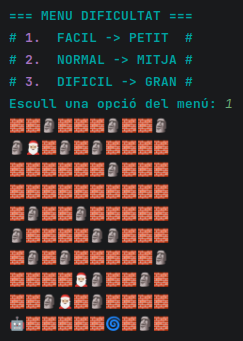
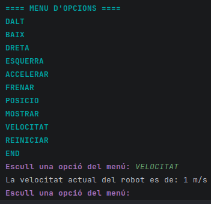
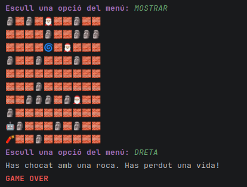
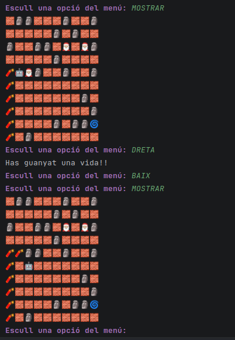
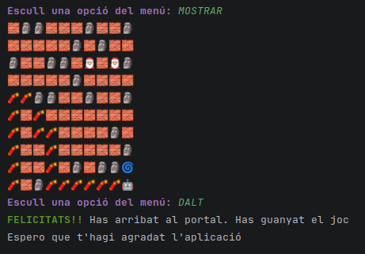
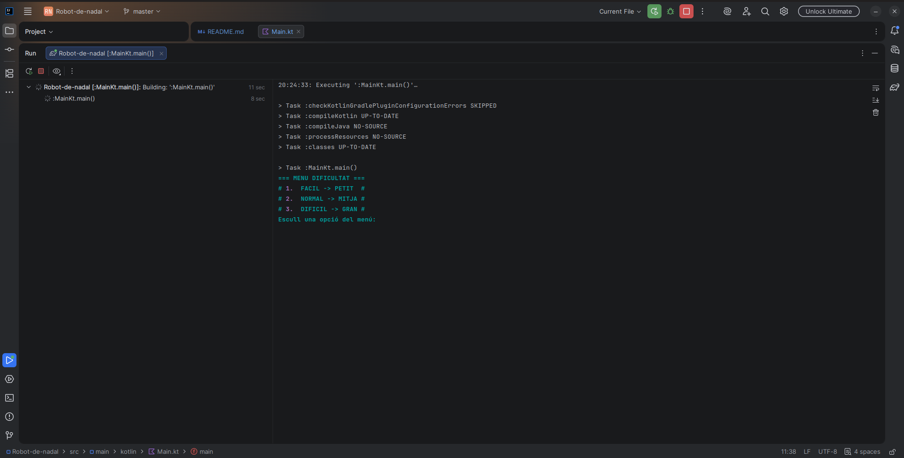

# 🤖 Robot de Nadal 🤖

## 📌 Descripció del projecte

Aquest projecte consisteix en un **joc de consola desenvolupat en Kotlin** on un robot es mou per un tauler bidimensional seguint les instruccions introduïdes per l'usuari. 
El robot pot: 
  - desplaçar-se cap a: DALT, BAIX, DRETA i ESQUERRA
  - moure's segons una velocitat configurable per l'usuari
  - interactuar amb diferents tipus de caselles (🧱, 🪨, 🧨, 🎅🏼, 🌀)
  - perdre o guanyar vides segons les col·lisions
  - guanyar la partida al arribar al portal

---

## 🎯 Objectius del projecte

- Practicar:
  - `Data class`
  - `ENUM`
- Implementar **lógica de movimient pas a pas**
- Gestionar **colisions**
- Millorar la qualitat del codi mitjançant:
  - `refactor`
  - Reducció de duplicació de codi amb `funcions`
- Documentar correctament el codi i el projecte en aquest `README.md`

---

## 🕹️ Funcionament del joc

1. L'usuari selecciona la **dificultad** del joc:
   - Fácil → taulell 10x10 caselles.
   - Normal → taulell 20x20 caselles.
   - Difícil → taulell 30x30 caselles.

    
2. El robot comença en la **cantonada inferior esquerra** del taulell.

3. L'usuari introduiex instruccions desde el menú:
   - `DALT`
   - `BAIX`
   - `ESQUERRA`
   - `DRETA`
   - `ACCELERAR`
   - `FRENAR`
   - `POSICIO`
   - `VELOCITAT`
   - `MOSTRAR`
   - `REINICIAR`
   - `END`

    
4. El robot es mou segons la seva velocitat i:
   - perd una vida al sortir del taulell:

    
   - perd una vida al chocar amb una roca o una dinamita:

    
   - guanya una vida al chocar amb un Pare Noel i es transforma a roca:

    
   - guanya la partida al arribar al Portal Màgic:

    
---

## 🛠️ Tecnologíes utilitçades

- Llenguatge: **Kotlin**
- Entorn: **Consola**
- Eines:
  - IntelliJ IDEA
  - Git/Github

---

## Video demostració del funcionament del joc
(fes clic a la imatge)

---

## 👤 Autor

- **Nom:** Xavi Hurtado Picón
- **Curs:** 1er de Desenvolupament d'aplicacions web (DAW)  
- **Any:** 2025-2026

---
